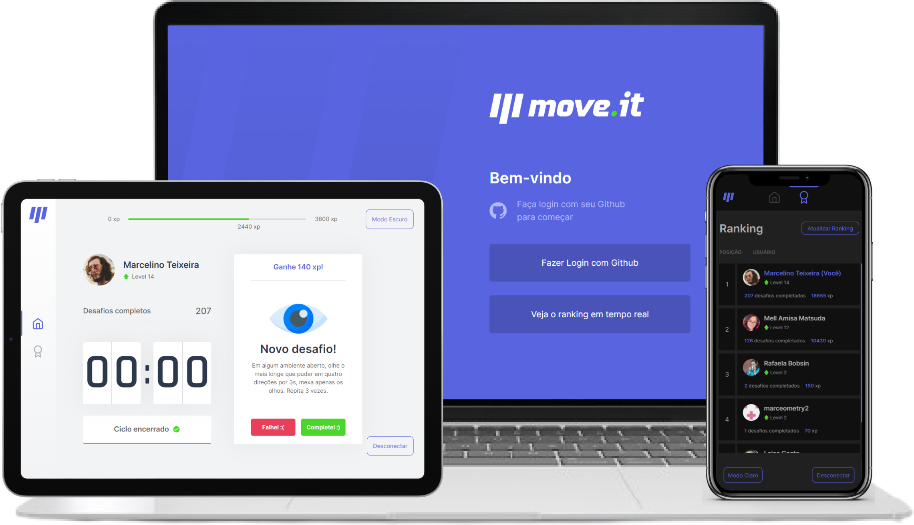

<h1 align="center">
  
</h1>

  <a href="#-tecnologias">Tecnologias</a>&nbsp;&nbsp;&nbsp;|&nbsp;&nbsp;&nbsp;
  <a href="#-projeto">Projeto</a>&nbsp;&nbsp;&nbsp;|&nbsp;&nbsp;&nbsp;
  <a href="#-layout">Layout</a>&nbsp;&nbsp;&nbsp;|&nbsp;&nbsp;&nbsp;
  <a href="#-como-executar">Como executar</a>

 

  

## 🚀 Tecnologias

Esse projeto foi desenvolvido com as seguintes tecnologias:

- [React](https://reactjs.org)
- [Next.js](https://nextjs.org/)
- [TypeScript](https://www.typescriptlang.org/)
- [MongoDB](https://www.mongodb.com/1)

## 💻 Projeto

<h4> Acesse em: https://nlw-move-it-beta.vercel.app </h4>

O move.it é um app que une a técnica de Pomodoro com a realização de exercícios físicos para quem passa muito tempo na frente do computador, feito durante o evento `Next Level Week 4`, da [Rocketseat](https://github.com/rocketseat-education).

## 🚀 Funcionalidades que adicionei após o evento

- Dark theme
- Responsividade
- Login pelo github utilizando o [NextAuth](https://next-auth.js.org/)
- Cadastro do usuário em banco de dados utilizando o [MongoDB](https://www.mongodb.com/1)
- Ranking de usuários, buscando as informações através da função getServerSideProps do [Next.js](https://nextjs.org/)
- Animações de loading utilizando o [Nprogress](https://ricostacruz.com/nprogress/)
- Scrollbars customizadas 

## 🔖 Layout

Você pode visualizar o layout do projeto através [desse link](https://www.figma.com/file/94DF9saEUNO6t7suaTVgmZ/Move.it-2.0-NLW-4). É necessário ter conta no [Figma](http://figma.com/) para acessá-lo.

## 🚀 Como executar

- Clone o repositório
- Instale as dependências com `yarn`
- Crie um Github App para que seja possível fazer o login
- Pegue o ID e o SECRET do App que você criou, e coloque em um arquivo `.env.local`, como exemplificado no `.env.example`
- Crie uma conta e um cluster no MongoDB
- Coloque a URL do banco de dados no arquivo `.env.local` como exemplificado no `.env.example`
- Inicie o servidor com `yarn dev`

Agora você pode acessar [`localhost:4444`](http://localhost:4444) do seu navegador, logar com seu github e utilizar sua própria base de dados.

---

<h4 align="center"> Feito com ♥ por Marcelino Teixeira </h4>
